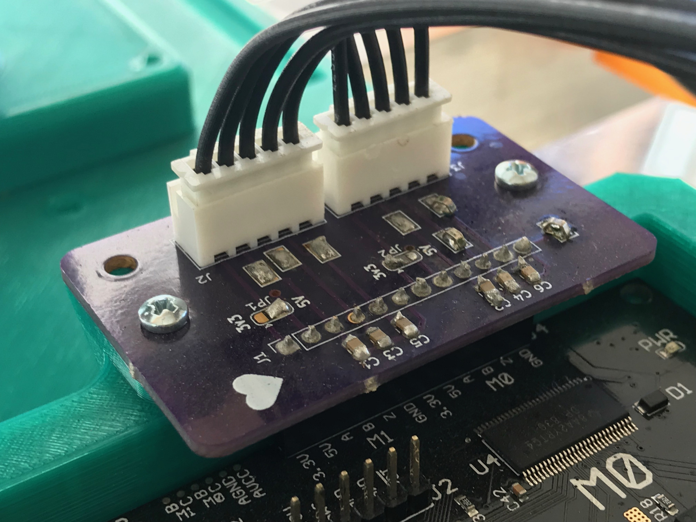
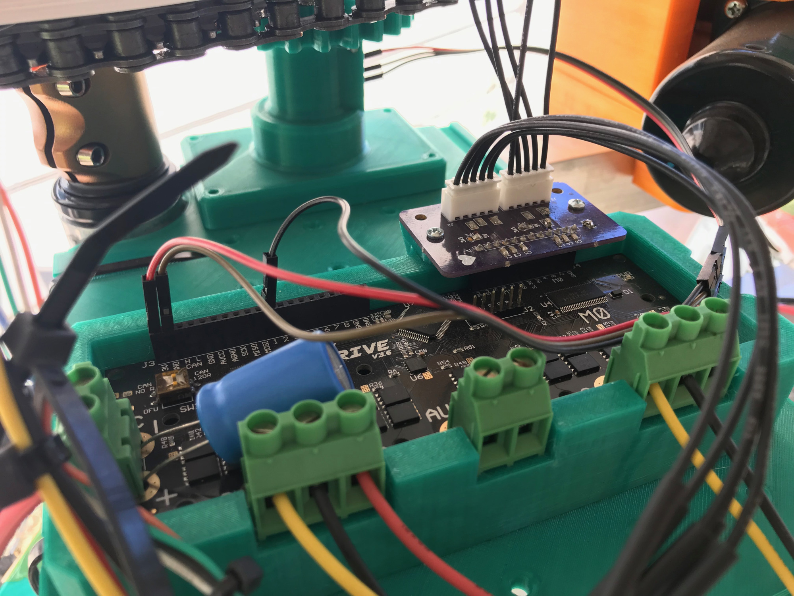
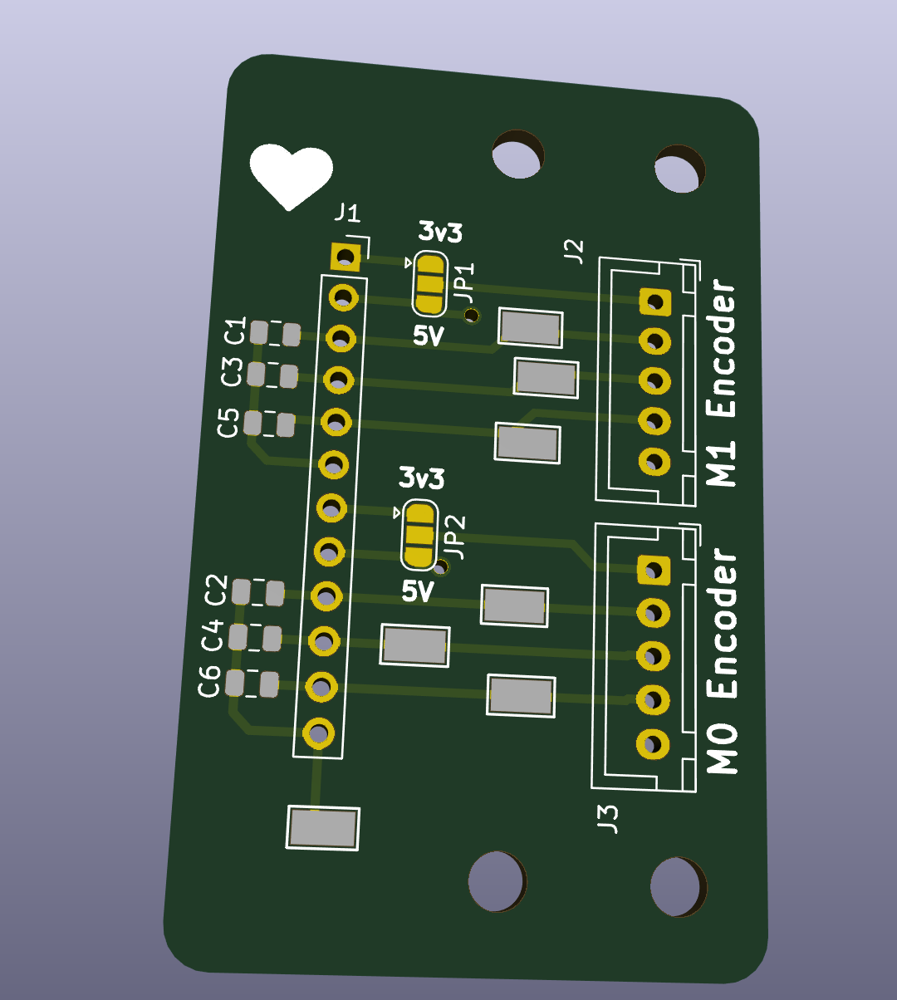
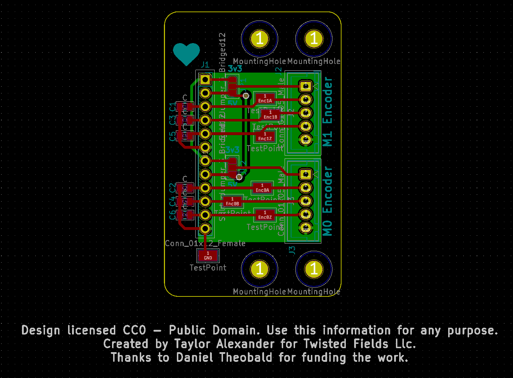
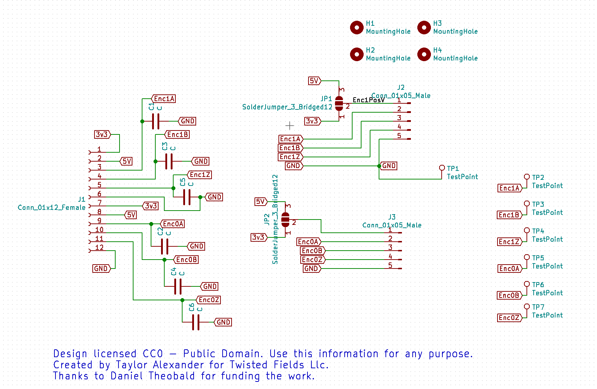

Meow I'm a cat.

This repo contains Kicad files for an Odrive encoder adapter board.

This board plugs in to your Odrive and gives you connectors for your encoders.

It uses 5 pin JST XH connectors and works great with ABZ encoders or hall sensors.

See parts_list.txt for a parts list.

Order the PCB directly from OSHPark here:
https://oshpark.com/shared_projects/uQ8zueoF

This board was designed by Taylor Alexander for Twisted Fields LLC.
Big thanks to Daniel Theobald for funding the work.

This work is licensed CC0 aka Public Domain. Use this information for any purpose.

